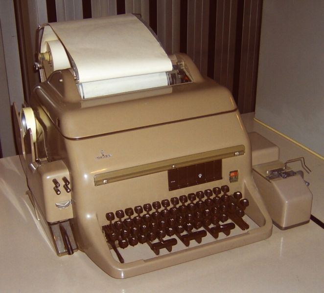
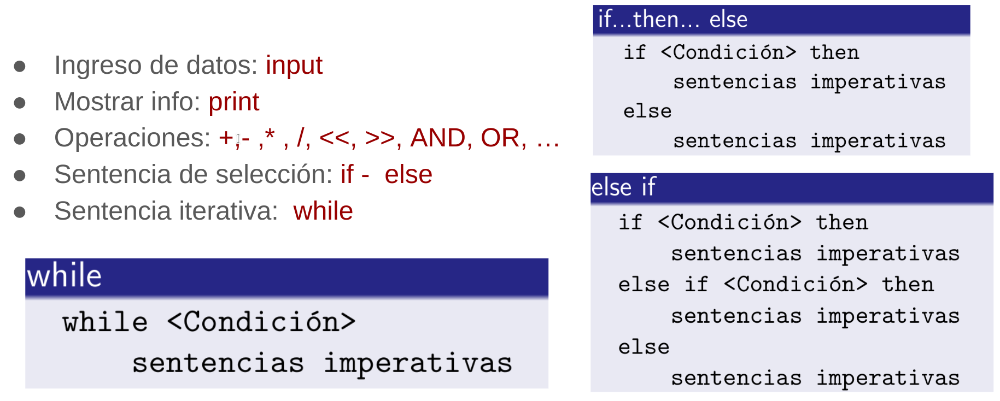
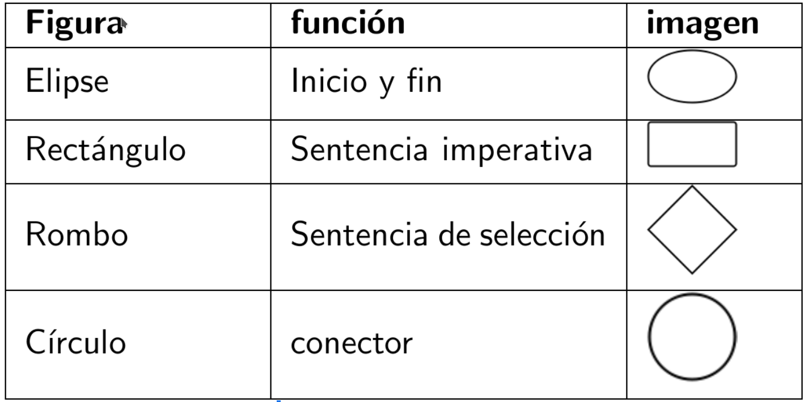
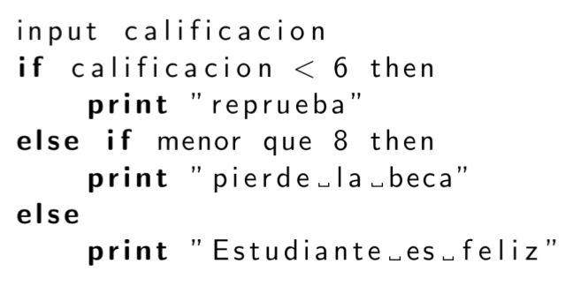
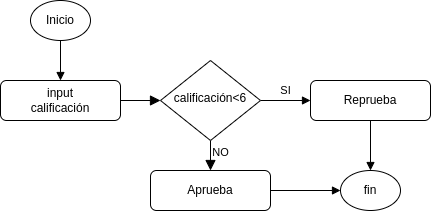

# Miguel Ángel Robles

- Ing. Eléctrico Electrónico
- M. Ciencia e Ingeniería de la Computación
- Técnico Académico en el ICAyCC
    * Grupo IOA 
    * Sección de Instrumentación y Observación Atmosférica
- Cursos de Instrumentación y robótica en la ENCiT
- Cursos de programación en el ICAyCC

email: miguel.robles@atmosfera.unam.mx

\includegraphics[width=0.3\textwidth]{img/insta_qr.png}

# Uds:

- Nombre
- Ocupación
- Intereses
- Expectativas/aplicación del Módulo

# Anaconda

## https://www.anaconda.com/download/success
\center

\includegraphics[height=0.65\textheight]{img/anaconda.png}

# Definiciones

- Programar: 
- Computadora: 
- Computadora programable: 
- Lenguaje de programación: 
- Programa: 
- Emulador de terminal:

# Definiciones

- Programar: dar instrucciones a una computadora
- Computadora: sistema ( electrónico) con capacidades de cómputo (cálculo).
- Computadora programable: computadora capaz de recibir y ejecutar instrucciones.
- Lenguaje de programación: lenguaje con reglas bien definidas que permiten indicar instrucciones a una computadora.
- Programa: conjunto de instrucciones en algún lenguaje de programación

# Definiciones

- Emulador de terminal: software que simula una terminal de acceso a una computadora

:::columns

:::: column

::::

:::: column

::::

:::

\tiny{Fuente: wikipedia}

# Planeación

Planear un programa es importante:

- Reduce su tiempo de desarrollo,
- simplifica su implementación y
- facilita su depuración y mejora.
- Se debe comenzar con un algoritmo que después debe convertirse a pseudocódigo y/o diagrama de flujo.

# Herramientas de planeación

- Algoritmo: Conjunto ordenado de instrucciones con un fin
- Diagrama de flujo: Representación gráfica de un algoritmo
- Pseudocódigo: Es un intermedio entre algoritmo y un lenguaje de programación formal

\begin{center}
\includegraphics[width=0.5\textwidth]{img/planea_ciclo.png}
\end{center}

# Tipos de Instrucciones

- Imperativas: son instrucciones de ingreso y salida de datos, así como operaciones (matemáticas, de comparación, de bits, etc)
- Iteración: son instrucciónes que permiten la repetición de un bloque de instrucciones
- Selección: permiten decidir la ruta del programa a partir de una condición

# Pseudocódigo

# Diagrama de flujo

# Ejemplos
Pseudocódigo / Diagrama de flujo

\includegraphics[width=0.4\textwidth]{img/ex_pseudo.png}
\includegraphics[width=0.5\textwidth]{img/ex_dflujo.png}
<!--

{width=200px}

{width=200px}
-->

# Actividad

### >> Realizar el algoritmo y Diagrama de Flujo de un programa que realiza la creación de un mapa a partir de datos de salidas de un modelo numérico de pronóstico de manera diaria.

- Asuma que los datos se obtienen de un servidor (no se encuentran en su computadora)
- Incluya una etapa de descarga u obtención de datos
- Tenga en cuenta que los datos pueden no estar disponibles algunos días

# Tipos de lenguaje de programación

- Por forma de ejecución:
  - Interpretado: las instrucciónes interpretan y ejecutan mientras se corre el programa
  - Compilado: las instrucciones se interpretan (compilan) previo a la ejecución del programa

- Por nivel de complejidad:
  - Bajo nivel: más cercano al lenguaje máquina
  - Alto nivel: más cercano al lenguaje humano

# Filosofía de programación

Metodología en la forma de escribir programas

- lineal: las instrucciones son escritas de manera lineal. Esto es de manera continua
- funcional: el código se agrupa en bloques reusables (funciones)
- Orientada a objetos: abstrae la programación en objetos, estos contienen funciones y variables

